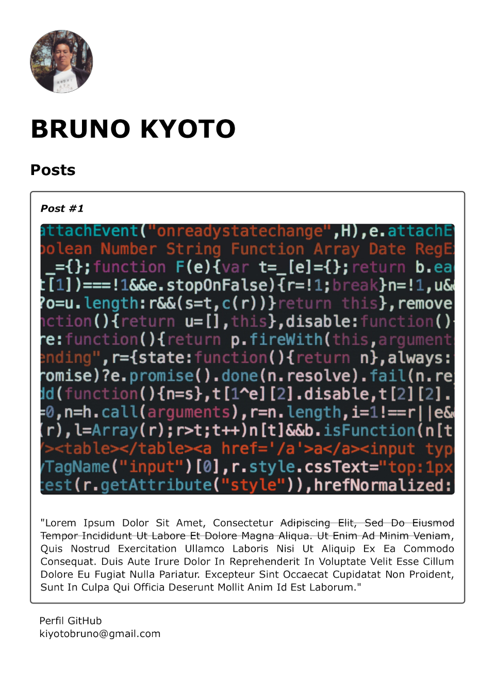

# Introdução a Criação de Website com HTML5 e CSS3
## Exercício Prático

### <sub>SCREENSHOT</sub>



### <sub>CÓDIGO-FONTE</sub>

#### [_**HTML**_](Arquivos/index.html)

```
<!DOCTYPE html>
<html lang="pt-BR">
	<head>
		<meta charset="UTF-8">	
		<title>Bruno Kyoto</title>
		<link rel="stylesheet" href="./style.css" />
	</head>
	<body>
		<header>
			
			<h1 id="title">Bruno Kyoto</h1>
		</header>
		<section>
			<header>
				<h2 class="subtitle">Posts</h2>
			</header>
			<article class="post">
				<header>
					<h3 class="post_title">Post #1</h3>
					
				</header>
				<p class="post_content">
					"Lorem ipsum dolor sit amet, consectetur <a href="https://lipsum.com/" alt="link para o website Lipsum.com">adipiscing elit, sed do eiusmod tempor incididunt ut labore et dolore magna aliqua. 
					Ut enim ad minim veniam</a>, quis nostrud exercitation ullamco laboris nisi ut aliquip ex ea commodo consequat. 
					Duis aute irure dolor in reprehenderit in voluptate velit esse cillum dolore eu fugiat nulla pariatur. 
					Excepteur sint occaecat cupidatat non proident, sunt in culpa qui officia deserunt mollit anim id est laborum."					
				</p>
			</article>
		</section>
		<footer>
			<ul class="contact_list">
				<li><a href="https://github.com/FawkesC05" target="_blank">Perfil GitHub</a></li>
				<li><a href="mailto:kiyotobruno@gmail.com" target="_blank">kiyotobruno@gmail.com</a></li>
			</ul>
		</footer>
	</body>
</html>
```

#### [_**CSS**_](Arquivos/style.css)

```
body {
	background: #f7f7f7;
	font-family: Verdana;
	max-width: 900px;
	margin: auto;
}

.photo {
	border: 1px solid #505050;
	border-radius: 50%;
}

#title, .subtitle, .post_title {
	color: #505050;
}

#title {
	font-size: 40px;
	text-transform: uppercase;
}

a {
	text-decoration: line-through;
	color: #505050;
}

.post_title {
	font-size: 16px;
	font-style: italic;
	margin: 0;
	margin-bottom: 15px;
}

.post {
	background: #fff;
	padding: 15px;
	border: 2px solid #505050;
	margin-bottom: 15px;
	border-radius: 5px;
}

.post_content {
	margin: 0;
	margin-top: 15px;
	text-transform: capitalize;
	text-align: justify;
}

.post_image {
	margin-bottom: 15px;
	border-radius: 5px;
	width: 100%;
}

.contact_list {
	list-style-type: none;
	padding-left: 15px;
}

.contact_list li a {
	text-decoration: none;
}
```